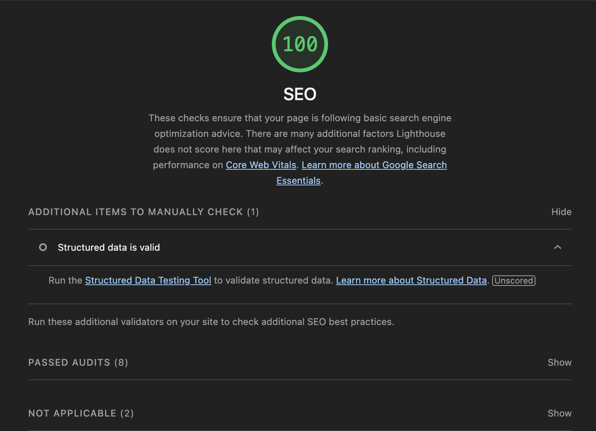

# Tech Spec

## Overview

Multi-tenant career site builder. Companies can log in, customize their career page, and publish it. Built on Next.js 16 with Supabase for auth + data, Cloudflare R2 for asset storage.

## Stack

- **Framework**: Next.js 16 (App Router, React 19, TypeScript)
- **Auth/DB**: Supabase (Postgres + RLS)
- **Storage**: Cloudflare R2 (S3-compatible)
- **Styling**: Tailwind v4, Radix UI, Framer Motion
- **State**: Zustand (minimal usage)
- **Forms**: react-hook-form + zod

## Architecture

### Multi-tenancy

Each user belongs to exactly one company. RLS policies enforce data isolation.

- `companies` table: one row per tenant
- `company_users` table: links `auth.users` to `companies`
- Helper function `auth.user_company_id()` returns the company_id for the current session

All content tables (jobs, perks, testimonials, etc.) have a `company_id` foreign key. RLS policies filter by `auth.user_company_id()`.

Public preview pages use `anon` role policies (no auth required).

### Routes

- `/login` - Supabase email/password auth
- `/editor` - authenticated dashboard (sections: hero, life, values, perks, locations, testimonials, jobs)
- `/brand-assets` - optional AI-powered profile enrichment
- `/preview/[companyId]` - public career site (no auth)
- `/api/upload` - image upload to R2

Middleware (`middleware.ts`) checks auth state and redirects unauthenticated users to `/login` (except for `/`, `/preview/*`, `/api/*`).

### Database Schema

See `database/migration.sql` for full DDL.

Key tables:

- `company_profile` - hero section, branding (logo, colors, tagline)
- `life_section` - single row per company
- `value_items`, `perks`, `testimonials`, `locations`, `jobs` - multi-row collections

All tables have RLS enabled. Authenticated users can CRUD their own company's data. Anonymous users can SELECT for preview.

### File Uploads

Images go to Cloudflare R2 via `/api/upload`.

- Client sends FormData with `file`, optional `maxSizeMB`, `allowedFormats`
- Server validates, generates UUID filename, uploads to R2, returns public URL
- Uses `@aws-sdk/client-s3` (R2 is S3-compatible)

Config in `.env`:

```
CLOUDFLARE_ACCOUNT_ID
CLOUDFLARE_R2_ACCESS_KEY_ID
CLOUDFLARE_R2_SECRET_ACCESS_KEY
CLOUDFLARE_R2_BUCKET_NAME
CLOUDFLARE_R2_PUBLIC_DOMAIN
```

### AI Profile Enrichment (Optional)

The Route `/brand-assets`. User enters company URL, system scrapes metadata and generates profile suggestions.

Pipeline:

1. **Scrape** - Apify Web Scraper extracts meta tags, JSON-LD, Open Graph data
2. **Image selection** - heuristic picks best logo/image from scraped data
3. **Color extraction** - Imagga API extracts dominant colors from image
4. **LLM refinement** - OpenAI or Ollama generates structured company profile (name, tagline, description, hero copy)

Fallback: if any service is missing, uses heuristic extraction from raw metadata.

Services:

- `ApifyMetadataScraperService` - scrapes URL
- `ImaggaColorExtractionService` - extracts colors
- `OpenAIRefinementService` / `OllamaAIRefinementService` - LLM-based profile generation

All optional. If env vars missing, feature is disabled or falls back to manual input.

### Server Actions

All mutations use Next.js server actions (`'use server'`).

Located in `src/lib/actions/`:

- `companyProfile.ts` - update hero, branding
- `lifeSectionInline.ts` - update life section
- `valueItemsInline.ts`, `perksInline.ts`, `testimonialsInline.ts`, `locationsInline.ts` - CRUD for collections
- `jobsInline.ts` - CRUD for jobs
- `aiProfile.ts` - AI enrichment pipeline

Each action:

1. Gets user from Supabase SSR client
2. Looks up company_id from `company_users`
3. Performs DB operation (RLS auto-filters by company)
4. Returns `{ success, data?, error? }`

### Preview Page

`/preview/[companyId]` is public. Fetches all sections for given company using `anon` client.

Sections rendered conditionally based on data presence (e.g., if no testimonials, section is hidden).

Uses same preview components as editor (live preview).

### SEO & Lighthouse Proof



## Environment Variables

Required:

- `NEXT_PUBLIC_SUPABASE_URL`
- `NEXT_PUBLIC_SUPABASE_ANON_KEY`
- `CLOUDFLARE_ACCOUNT_ID`
- `CLOUDFLARE_R2_ACCESS_KEY_ID`
- `CLOUDFLARE_R2_SECRET_ACCESS_KEY`
- `CLOUDFLARE_R2_BUCKET_NAME`
- `CLOUDFLARE_R2_PUBLIC_DOMAIN`

Optional (AI enrichment):

- `APIFY_TOKEN`
- `IMAGGA_API_KEY`, `IMAGGA_API_SECRET`
- `LLM` (openai | ollama)
- `OPENAI_API_KEY`, `OPENAI_MODEL`
- `OLLAMA_BASE_URL`, `OLLAMA_MODEL`

## Performance Notes

- Supabase client is created per-request (SSR). No connection pooling on client side.
- AI enrichment can take 30-90s (Apify scrape + LLM call). Uses 90s timeout.
- No lazy loading on editor (all sections load at once).
- Preview page fetches all sections in parallel (multiple Supabase queries).

## Security

- RLS enforces tenant isolation (user can't access other companies' data)
- Middleware redirects unauthenticated users
- File uploads validate file type and size server-side

## Deployment

Designed for Vercel. Uses Next.js 16 features (App Router, server actions, middleware).

Build command: `npm run build`
Start command: `npm start` (or Vercel auto-detects)

R2 bucket must be created in Cloudflare dashboard. Set CORS policy to allow uploads from your domain.
